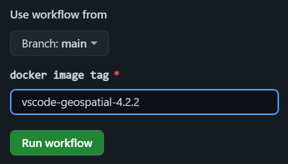

# Docker images for writing R and LaTeX in Visual Studio Code

## Release

Manually run `Docker Build and Push` workflow with the target docker image tag.

## Image tags

### Base images (R & LaTeX)

All images are derived from [rocker-project](https://rocker-project.org/images/) images.

Note that these images contain all of the TeXLive packages and very slow to build.

- `verse-4.2.2`
- `geospatial-4.2.2`

### VSCode images

These images are dependent on the corresponding base images.

- `vscode-verse-4.2.2`
- `vscode-geospatial-4.2.2`
